

  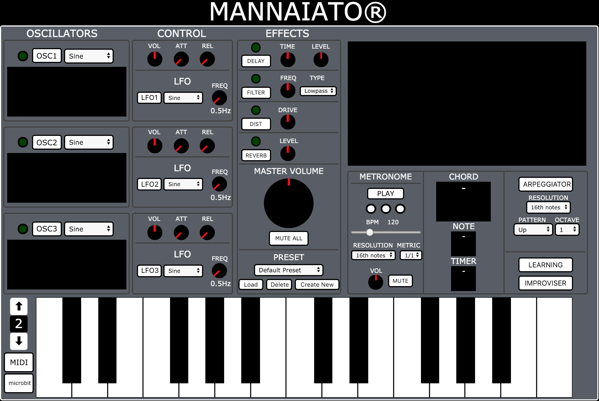

# MANNAIATOR SYNTH 1.0
Mannaiator is a digital synthesizer, based on the classic sound functionalities of a synthesizer with the added feature of an innovative improviser algorithm that utilises Markov Chains to play new and interesting melodies. 

Find it online: http://mannaiatorproject.surge.sh/

## Creators
- Carmelo Fascella
- Matteo Acerbi
- Edoardo Epifani 
- Husain Taqi

## Main Features
- Sound Synthesis 
- Effects Panel
- Midi and bluetooth microbit connections 
- Preset selection 
- Timing module (click) 
- Chord recognition 
- Arpeggiator module 
- Improviser module

## Sound synthesis
- Sound synthesis is generated by Web Audio API. There are three different oscillators, and for each one it is possible choose a different waveform (sine, square, triangle, sawtooth), as well as dedicated volume, attack and release value by the dedicated knob. They can work separately or togheter creating interesting sounds. 

- There’s also a small LFO section, providing amplitude modulation on each oscillator, with its own variable frequency and waveform selection. The LFO button has a pulsating light, that blinks in accordance with the selected frequency. 

 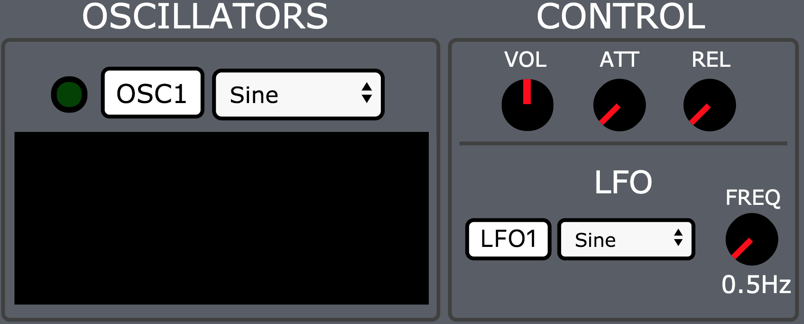 

#### Knobs
- Each knob works in the same way. It has got 20 steps and each step assumes a different value in base of its function. Moving the knob, a function calculates the current grade of the knob, and according to it, the value referred to that knob is changed in real time.

## Effects Panel
- The chain of effects is built in serie with the three oscillators and it can be built in real time choosing a combination of the following effects: 

    - **Delay**: It can be managed using TIME and LEVEL knob. The first one controls the delay time and the second one the delay volume.

    - **Filter**: There are two kind of filters: LOWPASS and HIGHPASS, that are controlled by a frequency cutoff that ranges from 20Hz to 20kHz

    - **Distortion**: This is a distortion built mathematically by a function. Its drive can be controlled by DRIVE knob.
    - **Reverb**: This effect is based on an impulse response loaded in the "impulse.js" file. The dry/wet level can be controlled by knob LEVEL.
    
    - The **Master Volume** knob controls the general volume of the synthetizer.

    
 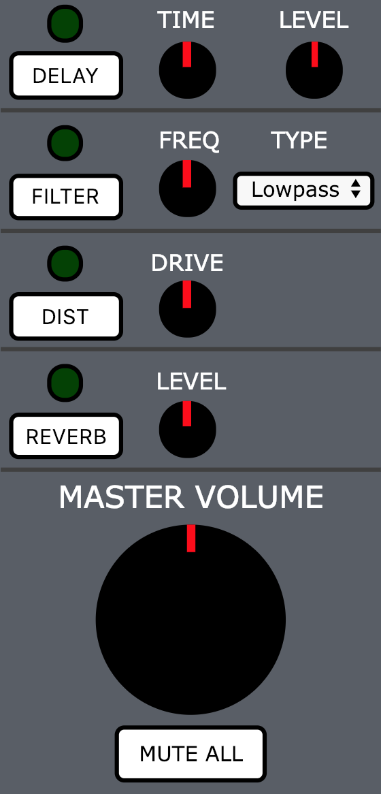 

    
## Onscreen Keyboard
- It can be used either with the mouse, PC keyboard or MIDI controller.

- With the "up" and "down" button, you can change the octave range if you play with the mouse or with PC keyboard.

- The keys of the pc keyboard that can be played are "q2w3er5t6y7uzsxdcvgbhnjm,", with the Caps Lock turned on or off.

 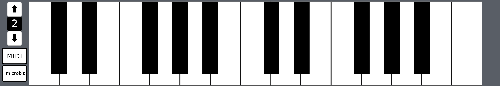

#### MIDI
- Press the MIDI button before starting to play with your MIDI controller. 
- You can change the octave directly from your midi device.

## Timing Module
- The Metronome has variable, selectable speeds within the range 10-470 BPM. To activate it, press the PLAY button, and press STOP to stop it. 

- The RESOLUTION option allows the user to set a metronome that clicks on each 16th note, 8th note or quarter note. It also offers the option METRIC which allows the user to choose which metric pattern to follow. Here we have the most commonly used metric patterns, such as: 1/1, 1/2, 1/4, 3/4 ,4/4, 5/4, 7/4. 

- It is also possible to mute the metronome using the MUTE button, while maintaining the three blinking LEDs as a timing reference. They also permit the user to have a constant indication of the speed of both the metric pattern set by the metronome, as well as a repetitive sound that could be annoying to the user. Therefore, this feature could be very useful for better performances. 

 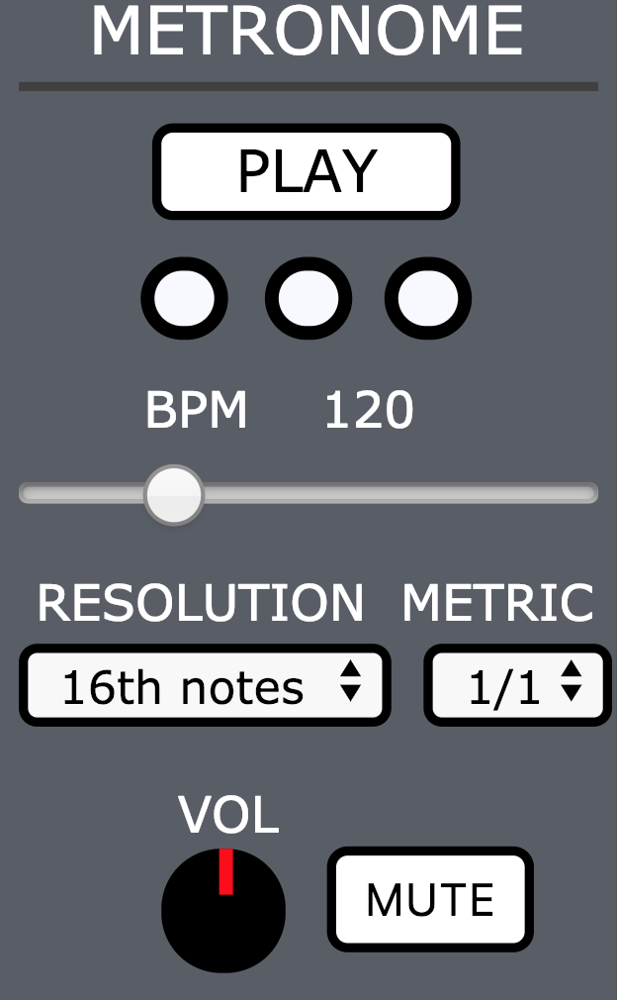

## Chord Recognition
- Mannaiator can recognize each type of 3-note chord and 4-note chord and its inversion if you play three or four notes at the same time during the ARPEGGIATOR, IMPROVISER and LEARNING mode.

- The chord recognition is an algorithm that calculates the distances from a note to another, and then it can recognize the chord, its tonic and a scale that matches the chord.

- The name of the chord recognized is displayed on the display CHORD.

- To activate the chord recognition, you can click on the button ACTIVATE.

 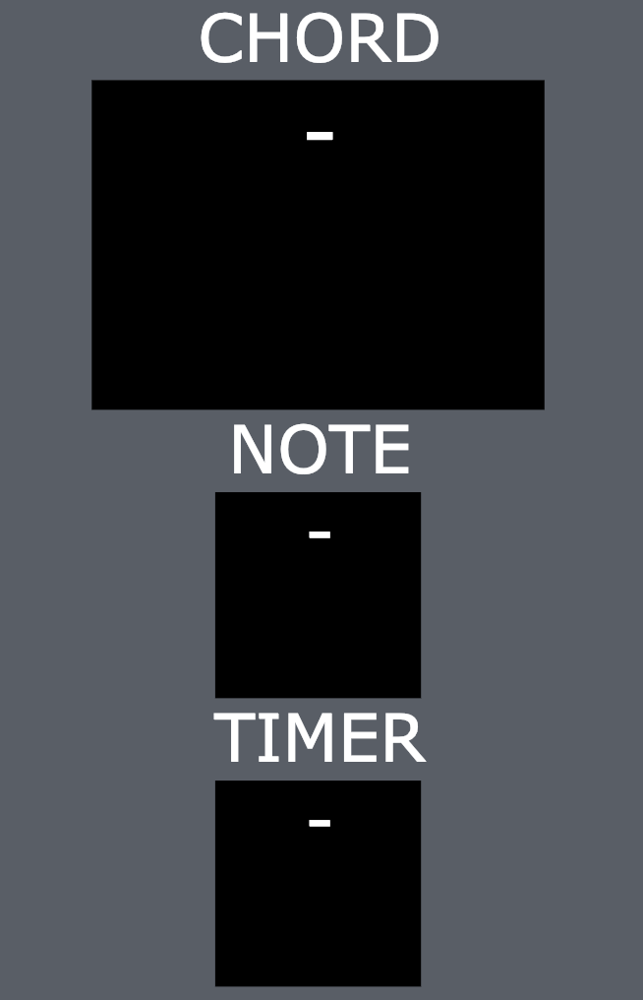

## Arpeggiator
- The arpeggiator follows the tempo set by the metronome. It also allows to set a different resolution. Different arpeggiator modes are available as follows: 
    - Up
    - Down
    - Up and Down
    - Down and Up

- With the OCTAVE button, you can choose the number of octaves that the arpeggiator goes through, going from one octave, up to four. This allows us to have a total of 16 different types of arpeggiator for every chord played. (This feature is available only in MIDI mode)
- The aforementioned CHORD RECOGNITION display shows the current chord performed by the arpeggiator. 

 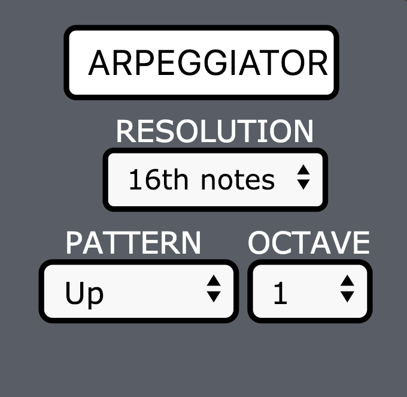

## Preset Selection
- The preset selector is based on Firebase realtime database. The CREATE NEW button allows to save the current state of the synth, including all knobs, selectors, buttons, etc. to be recalled at any time in the future. 
- Pressing CREATE NEW will show a prompt, allowing the user to pick a name for the preset. 
- The LOAD button loads the currently selected preset from the list. 
- DELETE can be used to delete the currently selected preset from the database, and therefore from the selection list.

 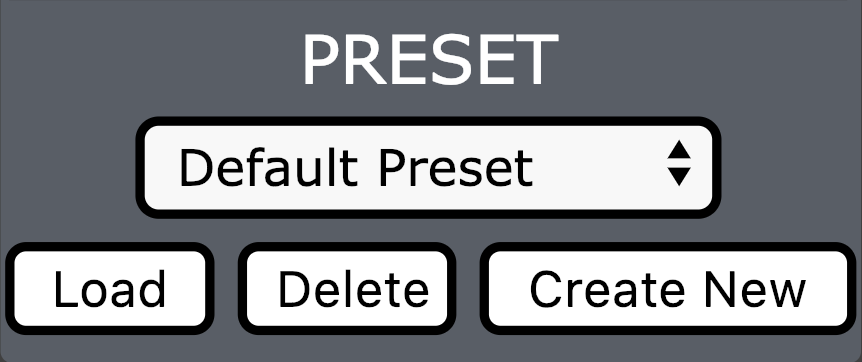

## Improviser
**The main feature of the Mannaiator is the improviser. The improviser works as follows:**

 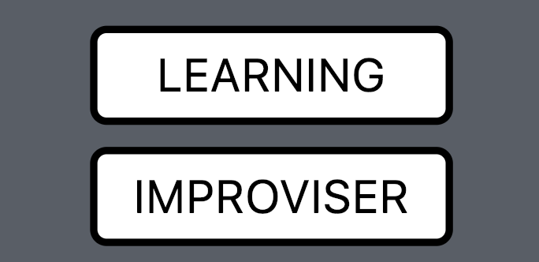

#### Learning Mode 
1.Press the LEARNING button.
 
2.Play a 4-note chord, then the chord-recognition algorithm will recognize it, the key 
and a proper scale that matches with the chord.
The scale is composed of 7 notes, and it starts from the tonic of the chord recognized before.

3.Then it will start a 60 second timer where you can play everything you want. The improvisation algorithm recognizes only the notes that match with the scale of the chord triggered before.

 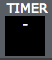

4.The algorithm learns how many times we play a certain note after another, the difference in time from the attack to the release of a certain note (the duration of the note) and the distance in time between each note played. When the time has run out or you press the LEARNING button again, the variables that will be used in the Markov-chain algorithm will be updated.

5.The algorithm that learns the distances in time between the notes has the BPM of the metronome as a reference, so during the learning time it is recommended to play with the metronome turned on, in order to have a precise timing.

6.The lengths of the notes and their distances that can be recognized, after a certain approximation, are:	
- Whole note
- Half note
- Quarter note
- Eighth note
- Sixteenth note

#### Improvisation Mode
1.Press the IMPROVISER button.

2.After you play a note, the Mannaiator starts playing, improvising on what you played before.

3.The improvisation is based on a Markov-chain algorithm, that calculates the next note to play, after how much time it can be played and its duration . This algorithm works on the probabilities calculated by the algorithm used in the learning mode.

4.The current note performed by the improviser is displayed on the display NOTE.

 

5.During the improvisation, it is possible to play something alongside the improviser. The idea is to perform a duet with the Mannaiator. 

6.If you play 4 notes together during the improvisation mode, Mannaiator will continue improvising in the scale of the new triggered chord, using the same variables learned before to decide what is the next note to play, its duration and the distance in time after that it can be played. So it will play the same improvisation in a different key.

#### Microbit Mode

 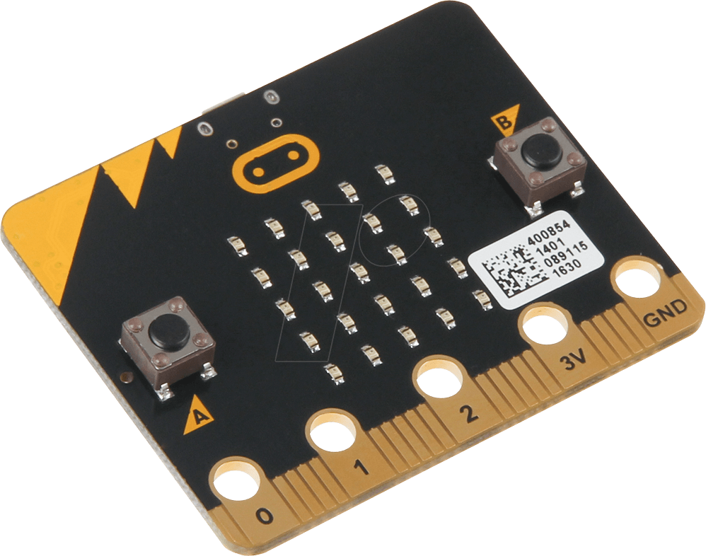

You can use a Microbit to change in real time the mode of the scale used during the improvisation. 
This mode works thanks to accelerometer of the microbit and the microbit.js library.

1.Turn on the Bluetooth of your pc.

2.Press the MICROBIT button.

3.Pair the microbit with your pc.

4.Move the microbit on left and right. You will see a new display on the top-right part of the frequency canvas that shows the current  mode of the scale. So by moving it, you can move the scale used by the improviser in a range of an octave up and down. This enables us to change the mode of the scale, while the scale remains the same. It’s just transposed up and down.

 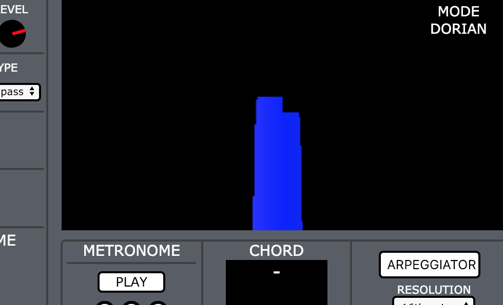

## Notes
- This project is dedicated to high-level professional musician that would try this new experience of playing with a machine, and have a full control of the sound generated by the synthetizer.
- It works both online and offline.
- The project is available on http://mannaiatorproject.surge.sh/
- The code is available on https://github.com/EdoEpi/Mannaiatore
- The code is written in HTML5, CSS and JAVASCRIPT
- The main IDEs to code are Brackets and Codepen.
- We used microbit.js library for bluetooth microbit connection, and Firebase to save the sound presets.
- The presentation video is available on https://www.youtube.com/watch?v=aa53g_rjSvI&t=1s

