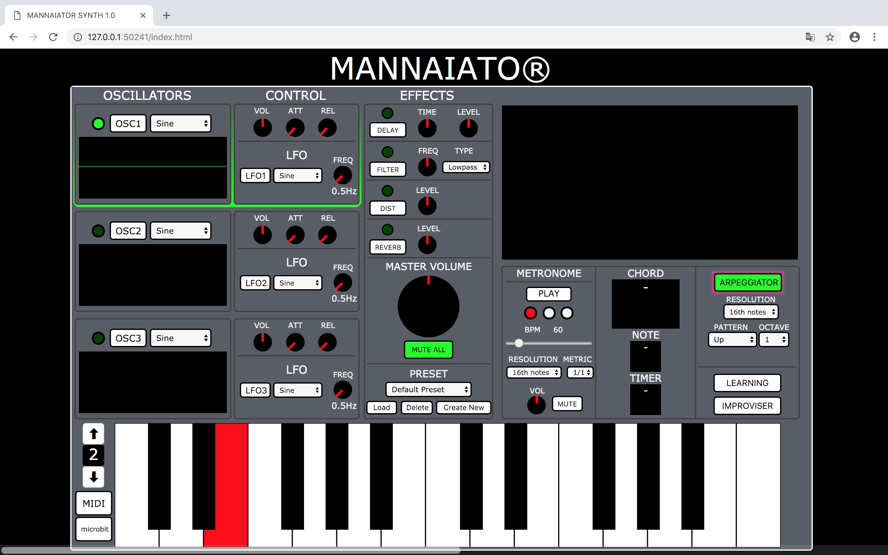

  

## MANNAIATOR SYNTH 1.0
Mannaiator is a digital synthesizer, based on the classic sound functionalities of a synthesizer with the added feature of an innovative improviser algorithm that utilises Markov Chains to play new and interesting melodies.

##CREATORS
Carmelo Fascella
Matteo Acerbi
Edoardo Epifani
Husain Taqi

##TOOLS USED
Codepen
Brackets
Firebase
Microbit

##MAIN FEATURES
Sound Synthesis
Effects Panel
Midi and bluetooth microbit connections
Preset selection
Timing module (click)
Chord recognition
Arpeggiator module
Improviser module

##Sound synthesis
Sound synthesis generated by Web Audio API Selectable waveform (sine, square, triangle, sawtooth) with display Dedicated volume, attack and release knob LFO with variable frequency and waveform selection

##Effects Panel
Delay:
Filter:
Distortion:
Reverb:
Ogni effetto è immesso in serie
We implements these effects without using external library.

##Onscreen keyboard
Can be used either with the mouse, PC keyboard or MIDI keyboard. Variable octave selector

##Timing Module
Metronome Variable speed within the range 10-470 BPM Variable metric measures and three types of resolutions. Per attivare il metronomo è sufficiente fare click sul tasto “play” ed è possibile eseguire la stessa operazione per lo “stop”  davide culi

##Chord Recognition
Recognises each possible triad and its inversions. Recognises each possible seventh chord (tertian) and its inversions. Recognises major, minor, diminished, augmented, etc. Algorithm based on calculating the distances between the played notes

##Arpeggiator
Three types of resolution (following the metronome) Different patterns and octave selector.

##Preset Selection

Based on Firebase database Saves the current status of the synth to be recalled at any time in the future

##Improviser
Learning algorithm based on Markov Chains that calculates the tempo and tone intervals of a previous improvisation of 60 seconds.

##HOW TO USE

Extra

Può suonarlo solo un utente di alto livello.
Funziona sia offline che online (ma offline non funzionano i preset ovviamente).
Abbiamo usato le librerie solo per microbit e firebase.
Il Mannaiator è su mannaiator.surge.sh
Lfo pulsa a tempo.
